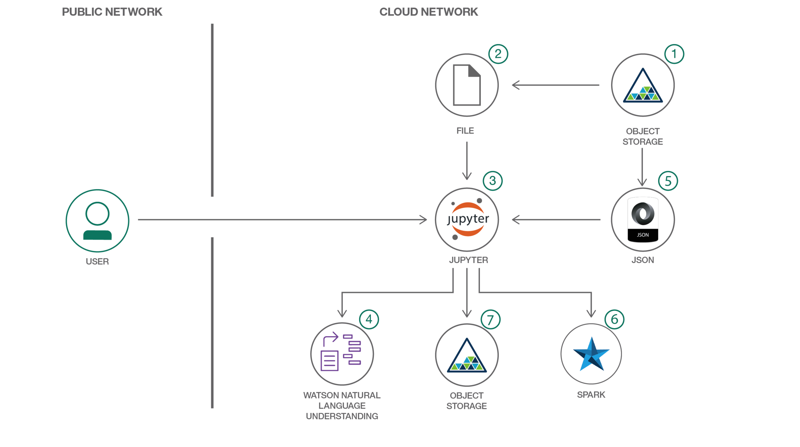
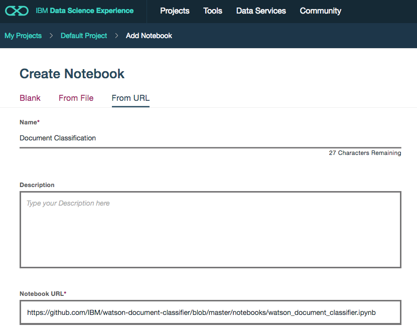
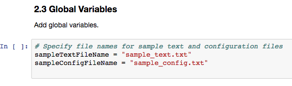
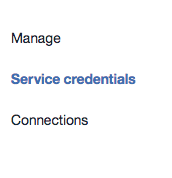
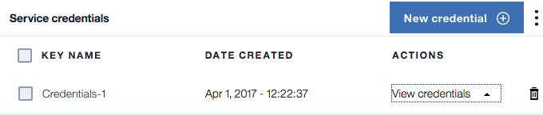
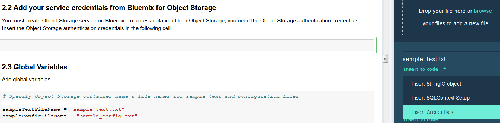
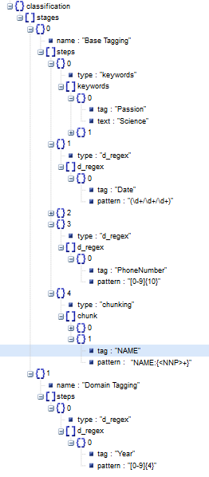

# Watson Natural Language Understanding과 IBM Data Science Experience를 활용하여 텍스트 분류 보강하기

*Read this in other languages: [English](README.md).*

이 개발자 과정에서는 IBM Data Science experience(DSX)에서 주피터 노트북을 사용하여 IBM Watson Natural Language Understanding API의 분석 결과를 텍스트 분류를 위한 구성 가능한 메커니즘을 통해 개선합니다.

이 개발자 과정을 완료하면 다음을 이해할 수 있습니다:

* DSX에서 주피터 노트북을 생성 및 실행합니다.
* DSX Object Storage를 사용하여 데이터 및 구성 파일에 접근합니다.
* 주피터 노트북에서 NLU API를 사용하여 문서의 메타데이터를 추출합니다.
* 간단한 Python 함수로 비정형 데이터를 추출하고 형식을 지정 합니다.
* 구성 파일을 사용하여 구성 가능하고 계층화된 분류 문법을 작성합니다.
* 구성 파일의 문법적 분류와 정규식 패턴을 조합하여 단어의 토큰 클래스를 분류합니다.
* 처리 결과를 JSON 형식으로 DSX Object Storage에 저장합니다.

이 개발자 과정은 Watson NLU를 학습시키기 위한 과거 데이터가 부족한 상황일 때 NLU API의 분류 메터데이터를 증강하는 방법을 배우고자 하는 개발자를 위한 과정입니다. 텍스트 분석 모델을 학습시키는 전통적인 방식은 기대보다 좋지 않은 결과를 산출합니다. 이 과정의 특징은 텍스트 분류의 구성 가능한 메커니즘을 허용하는 것입니다. 이는 일반적으로 분석하기 힘든 전문 도메인의 텍스트인 경우에 시작하는 데 도움을 줍니다.

## 포함된 구성 요소

* [IBM Data Science Experience](https://www.ibm.com/bs-en/marketplace/data-science-experience): Managed Spark와 같이 IBM value-adds를 포함하여 구성되고 협업이 가능한 환경에서 RStudio, Jupyter, Python 등을 사용하여 데이터를 분석하십시오.

* [Bluemix Object Storage](https://console.ng.bluemix.net/catalog/services/object-storage/?cm_sp=dw-bluemix-_-code-_-devcenter): 높은 신뢰성과 빠른 시장 출시 속도로 비용 효율적인 앱 및 서비스를 개발할 수 있도록 비정형 클라우드 데이터 저장 공간을 제공하는 블루믹스 서비스 입니다.

* [Watson Natural Language Understanding](https://console.bluemix.net/catalog/services/natural-language-understanding/?cm_sp=dw-bluemix-_-code-_-devcenter): 텍스트를 분석하여 컨셉, 엔티티, 키워드, 카테고리, 감정, 긍부정, 관계, 문맥적 역할 등의 메타데이터를 추출하는 블루믹스 서비스 입니다.

## 주요 기술

* [Jupyter Notebooks](http://jupyter.org/): 오픈 소스인 웹 애플리케이션으로 즉시 실행 가능한 코드, 방정식, 시각화된 차트 및 설명이 포함된 문서를 만들고 공유할 수 있습니다.

# 동영상

# 단계

이 개발자 과정을 구성하고 실행하려면 다음의 단계를 따르십시오. 각 단계의 세부 사항이 아래에 설명되어 있습니다.

1. [Data Science Experience 가입](#1-data-science-experience-가입)
1. [Bluemix 서비스 생성](#2-bluemix-서비스-생성)
1. [주피터 노트북 생성](#3-주피터-노트북-생성)
1. [데이터와 구성 파일 추가](#4-데이터와-구성-파일-추가)
1. [서비스 신임 정보 변경](#5-서비스-신임-정보-변경)
1. [노트북 실행](#6-노트북-실행)
1. [결과 다운로드](#7-결과-다운로드)
1. [결과 분석](#8-결과-분석)

## 1. Data Science Experience 가입

IBM [Data Science Experience](http://datascience.ibm.com/)에 가입하면 블루믹스 계정에 두개의 서비스(``DSX-Spark``와 ``DSX-ObjectStore``)가 생성됩니다.

## 2. Bluemix 서비스 생성

다음의 블루믹스 서비스를 생성하되 서비스 이름을 wdc-NLU-service로 작성합니다.

  * [**Watson Natural Language Understanding**](https://console.bluemix.net/catalog/services/natural-language-understanding)
  
  

## 3. 주피터 노트북 생성

[Data Science Experience](http://datascience.ibm.com/)에서:

상단 메뉴의 `Projects`를 선택하고 `Default Project`를 선택합니다.
우측 상단에 있는 `Add notebooks`를 클릭하여 노트북을 생성합니다.

* `From URL` 탭을 선택합니다.
* 노트북 이름을 입력합니다.
* (선택 사항) 노트북에 대한 설명을 입력합니다.
* 다음의 Notebook URL을 입력합니다.: https://github.com/IBM/watson-document-classifier/blob/master/notebooks/watson_document_classifier.ipynb
* `Create Notebook` 버튼을 클릭합니다.

## 4. 데이터와 구성 파일 추가

#### 데이터와 구성 파일을 노트북에 추가합니다

* `My Projects > Default` 페이지에서 `Find and Add Data`를 선택합니다. (`10/01` 아이콘을 찾으십시오.)
그리고 `Files` 탭을 선택합니다. 
* `browse` 버튼을 눌러 이 소스 코드 레파지토리에 있는 `watson-document-classifier/data/sample_text.txt`를 찾으십시오.
* `browse` 버튼을 눌러 이 소스 코드 레파지토리에 있는 `watson-document-classifier/configuration/sample_config.txt`를 찾으십시오.

> Note:  샘플 데이터 대신 다른 데이터나 구성 파일을 사용할 수 있습니다. 다른 구성 파일을 사용하려면 `configuration/sample_config.txt`에 있는 JSON 구조와 동일하게 하십시오.

#### 다른 데이터나 구성 파일을 사용하려면 파일 이름을 맞춰야 합니다

샘플 데이터 대신 다른 데이터 및 구성파일을 사용하는 경우, 주피터 노트북에서 데이터와 구성 파일을 참조하는 변수 값을 변경해야 합니다.
노트북에서 `2.3 Global Variables` 섹션에 있는 셀에서 글로벌 변수를 수정하십시오.

`sampleTextFileName`을 데이터 파일의 이름으로 변경하고 `sampleConfigFileName`을 구성 파일 이름으로 변경합니다.

## 5. 서비스 신임 정보 변경

#### Watson Natural Language Understanding 서비스의 신임 정보 입력
Watson Natural Langauage Understanding 서비스의 신임 정보를 입력하려면 노트북에서 `2.1 Add your service credentials from Bluemix for the Watson services` 섹션 아래의 셀을 선택합니다.

[Bluemix Dashboard](https://console.bluemix.net/dashboard/services)에서 Watson Natural Language Understanding 서비스인 `wdc-NLU-service`를 클릭합니다.

좌측에 있는 `Service Credentials`를 선택합니다.

UI에 열려있는 `Service Credentials`의 `KEY NAME`열에서 노트북에서 사용할 `Credentials`를 선택합니다. `View credentials`를 클릭하고 `username`과 `password` 값을 복사합니다. 이 값들은 UI에서 JSON 포맷으로 보여지고 있을 것입니다.

`2.1 Add your service credentials from Bluemix for the Watson services` 섹션 아래의 셀에서 `username`과 `password` 값을 변경합니다.

#### Object Storage 서비스의 신임 정보 입력
* `2.2 Add your service credentials for Object Storage` 섹션 밑의 셀에서 오브젝트 스토리지의 신임정보를 업데이트 할 수 있습니다.
* 셀의 내용을 삭제하십시오.
* `Find and Add Data`(`10/01` 아이콘을 찾으십시오.)를 사용하고 `Files` 탭을 이용합니다. 전에 업로드 한 파일 이름을 볼 수 있습니다. `2.2 Add...` 밑의 선택하신 셀이 비어있어야 합니다.
* `Insert to code`를 선택합니다(sample_text.txt 밑에 있습니다). 
* 드롭 다운 메뉴에서 `Insert Crendentials`를 선택합니다.
* 이 크리덴셜이 `credentials_1`로 저장된게 맞는지 확인하십시오..

## 6. 노트북 실행

노트북을 실행할 때 실제로 일어나는 일은 노트북에 있는 각각의 코드 셀이 순서대로, 위에서 아래로 수행됩니다.

> 중요: 노트북을 처음 실행한다면 section 1.1에 있는 필요한 패키지들을 설치하고 `Restart the kernel`을 수행해야 합니다.

각 코드 셀을 선택할 수 있고 왼쪽 여백에 태그가 있습니다. 태크 형식은 `In [x]:` 인데, 노트북의 상태에 따라 `x`는 다음의 값이 될 수 있습니다:

* 공백은 셀이 한번도 실행되지 않았음을 나타냅니다.
* 숫자는 이 코드 단계가 실행 된 상대적인 순서를 나타냅니다.
* `*`는 셀이 현재 실행 중임을 나타냅니다.

노트북에서 코드 셀을 실행시키는 방법은 다음과 같습니다:

* 한번에 하나의 셀만 실행
  * 실행할 셀을 선택하고 툴바에 있는 `Play` 버튼을 누릅니다.
* 순서대로 배치로 실행
  * `Cell` 메뉴바에는 몇 가지 옵션이 있습니다. 예를 들어 노트북에 있는 모든 셀을 실행하려면 `Run All` 버튼을 사용합니다. `Run All Below` 버튼으로 현재 선택된 셀 아래에 있는 첫번째 셀부터 시작시킬 수 있습니다. 
* 스케줄에 따라 실행
  * 노트북 패널의 우측 상단 섹션에 위치한 `Schedule` 버튼을 누르면 한번 또는 간격을 두고 반복적으로 노트북이 실행되도록 예약할 수 있습니다.

## 7. 결과 다운로드

* 결과를 보려면 [DSX-ObjectStore](https://console.bluemix.net/dashboard/storage) 사이트를 방문합니다.
* 오브젝트 스토리지의 이름을 클릭합니다.
* 노트북의 부여한 이름의 컨테이너를 클릭합니다.
* 파일 목록의 좌측에 있는 셀렉트 박스를 사용하여 `sample_text_classification.txt` 파일을 선택합니다.
* `SelectAction` 버튼을 클릭하여 나오는 드롭다운 메뉴에서 `Download File`을 클릭하면 `sample_text_classification.txt`를 다운로드할 수 있습니다.

## 8. 결과 분석

`5. Classify Text` 밑의 셀을 실행하고 나면 결과가 보여집니다.

구성 파일로 텍스트가 분류되는 방법을 조절할 수 있습니다. 구성 파일의 분류 과정은 Base Tagging과 Domain Tagging 단계로 나누어져 있습니다. Base Tagging 단계에서는 키워드 기반의 분류, 정규식 기반의 분류 및 정보 표현 기반의 태그를 지정할 수 있습니다. Domain Tagging 단계에서는 Watson NNU의 결과를 보강하기 위해 도메인 특화된 분류를 지정할 수 있습니다.

구성 파일을 수정하면 더 많은 키워드를 사용하거나 정규식을 추가할 수 있습니다. 이 방법으로 코드 변경 없이도 텍스트 분류를 보정할 수 있습니다.
필요하다면 구성 파일에 단계를 추가하여 관련 코드를 수정하면 텍스트 분류 결과를 더 개선할 수도 있습니다.

분류 결과에서 구성 파일에 지정된 키워드 및 정규 표현식이 표시된 분석 텍스트에서 올바르게 분류되었음을 알 수 있습니다.

# 문제 해결

[See DEBUGGING.md.](DEBUGGING.md)

# 라이센스

[Apache 2.0](LICENSE)
