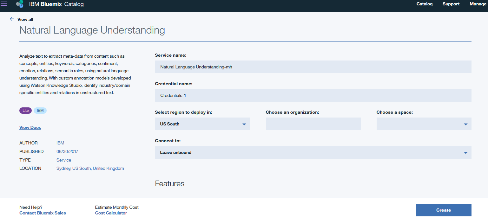

# Augmented Classification of text with Watson Natural Language Understanding and IBM Data Science experience

In this developer journey we will use Jupyter notebooks in IBM Data Science experience(DSX) to augment
IBM Watson Natural Language Understanding API output through configurable mechanism for text classification.

When the reader has completed this journey, they will understand how to:

* Create and run a Jupyter notebook in DSX.
* Use DSX Object Storage to access a data and configuration files.
* Use IBM Watson Natural Language Understanding API to extract metadata from document in Jupyter notebooks.
* Extract and format unstructured data using simplified Python functions.
* Use a configuration file to build configurable and layered classification grammar.
* Use the combination of grammatical classification and regex patterns from configuration file to classify word token classes.
* Store the processed output JSON in DSX Object Storage.

The intended audience for this journey is developers who want to learn method for augumenting classification metadata obtained from Watson Natural Language Understanding API, in situations when there is scarcity of historical data. The traditional approach of training a Text Analytics model yields less than expected results. The distinguishing factor of this journey is, it allows a configurable mechanism of text classification. It helps developer with a head start in case of text from specialized domain with no generally available english parser.

## Included components

* [IBM Data Science Experience](https://www.ibm.com/bs-en/marketplace/data-science-experience): Analyze data using RStudio, Jupyter, and Python in a configured, collaborative environment that includes IBM value-adds, such as managed Spark.

* [Bluemix Object Storage](https://console.ng.bluemix.net/catalog/services/object-storage/?cm_sp=dw-bluemix-_-code-_-devcenter): A Bluemix service that provides an unstructured cloud data store to build and deliver cost effective apps and services with high reliability and fast speed to market.

* [Watson Natural Language Understanding](https://console.bluemix.net/catalog/services/natural-language-understanding/?cm_sp=dw-bluemix-_-code-_-devcenter): A Bluemix service that can analyze text to extract meta-data from content such as concepts, entities, keywords, categories, sentiment, emotion, relations, semantic roles, using natural language understanding.

## Featured technologies

* [Jupyter Notebooks](http://jupyter.org/): An open-source web application that allows you to create and share documents that contain live code, equations, visualizations and explanatory text.

# Watch the Video

# Steps

Follow these steps to setup and run this developer journey. The steps are
described in detail below.

1. [Sign up for the Data Science Experience](#1-sign-up-for-the-data-science-experience)
1. [Create Bluemix services](#2-create-bluemix-services)
1. [Create the notebook](#3-create-the-notebook)
1. [Add the data and configuraton file](#4-add-the-data-and-configuration-file)
1. [Update the notebook with service credentials](#5-update-the-notebook-with-service-credentials)
1. [Run the notebook](#6-run-the-notebook)
1. [Download the results](#7-download-the-results)
1. [Analyze the results](#8-analyze-the-results)

## 1. Sign up for the Data Science Experience

Sign up for IBM's [Data Science Experience](http://datascience.ibm.com/). By signing up for the Data Science Experience, two services: ``DSX-Spark`` and ``DSX-ObjectStore`` will be created in your Bluemix account.

## 2. Create Bluemix services

Create the following Bluemix service by following the link to use the Bluemix UI and create it.

  * [**Watson Natural Language Understanding**](https://console.bluemix.net/catalog/services/natural-language-understanding)
  
  

## 3. Create the notebook

Use the menu on the left to select `My Projects` and then `Default Project`.
Click on `Add notebooks` (upper right) to create a notebook.

* Select the `From URL` tab.
* Enter a name for the notebook.
* Optionally, enter a description for the notebook.
* Enter this Notebook URL: https://github.com/IBM/watson-document-classifier/blob/master/notebooks/watson_document_classifier.ipynb
* Click the `Create Notebook` button.

## 4. Add the data and configuration file

#### Add the data and configuration to the notebook
Use `Find and Add Data` (look for the `10/01` icon)
and its `Files` tab. From there you can click
`browse` and add data and configuration files from your computer.

> Note:  If you don't have your own data and configuration files, you can get our example by cloning
this git repo. Look in the `data/sample_text.txt` directory for data file and in the `configuration/sample_config.txt`.
If you use configuration file from your computer, make sure to conform to the JSON structure given in `configuration/sample_config.txt`.

#### Fix-up variable names
Once the files have been uploaded into ``DSX-ObjectStore`` you need to update the variables that refer to the data and configuration files in the Jupyter Notebook.

In the notebook, update the global variables the in cell following `2.3 Global Variables` section.

Replace the `sampleTextFileName` with the name of the data file and `sampleConfigFileName` with the configuration file name.

## 5. Update the notebook with service credentials

#### Add the Watson Natural Language Understanding credentials to the notebook
Select the cell below `2.1 Add your service credentials from Bluemix for the Watson services` section in the notebook to update the credentials for Watson Natural Langauage Understanding. 

Open the Watson Natural Language Understanding service in your `Bluemix Dashboard`. You can follow the link below to use the Bluemix UI to open the service.
* [**Watson Natural Language Understanding**](https://console.bluemix.net/dashboard/services)

Once the service is open click the `Service Credentials` menu on the left.

In the `Service Credentials` that opens up in the UI, select `Credentials` you would like to use in the notebook from the `KEY NAME` column. Click `View credentials` and copy `username` and `password` key values that appear on the UI in JSON format.

Update the `username` and `password` key values in the cell below `2.1 Add your service credentials from Bluemix for the Watson services` section.

#### Add the Object Storage credentials to the notebook
Select the cell below `2.2 Add your service credentials for Object Storage` section in the notebook to update
the credentials for Object Store. 

Use `Find and Add Data` (look for the `10/01` icon) and its `Files` tab. You should see the file names uploaded earlier. Make sure your active cell is the empty one created earlier. Select `Insert to code` (below your file name). Click `Insert Crendentials` from drop down menu.

## 6. Run the notebook

When a notebook is executed, what is actually happening is that each code cell in
the notebook is executed, in order, from top to bottom.

Each code cell is selectable and is preceded by a tag in the left margin. The tag
format is `In [x]:`. Depending on the state of the notebook, the `x` can be:

* A blank, this indicates that the cell has never been executed.
* A number, this number represents the relative order this code step was executed.
* A `*`, this indicates that the cell is currently executing.

There are several ways to execute the code cells in your notebook:

* One cell at a time.
  * Select the cell, and then press the `Play` button in the toolbar.
* Batch mode, in sequential order.
  * From the `Cell` menu bar, there are several options available. For example, you
    can `Run All` cells in your notebook, or you can `Run All Below`, that will
    start executing from the first cell under the currently selected cell, and then
    continue executing all cells that follow.
* At a scheduled time.
  * Press the `Schedule` button located in the top right section of your notebook
    panel. Here you can schedule your notebook to be executed once at some future
    time, or repeatedly at your specified interval.

## 7. Download the results

The notebook stores the result in ``DSX-ObjectStore`` once it has completed the text classification. The results are stored in  `sample_text_classification.txt` file. Follow the link below to find the ``DSX-ObjectStore`` service listed. Click the ``DSX-ObjectStore`` in the list, click the listed containers to find `sample_text_classification.txt` in their file listing. Select `sample_text_classification.txt` file using select box on the left in the file listing. Click the `SelectAction` button on the top file of the file listing and use the `Download File` drop down menu to download `sample_text_classification.txt` file.

Follow the link to open your Object Store Service in Bluemix.
* [**DSX-ObjectStore**](https://console.bluemix.net/dashboard/storage)

## 8. Analyze the results

After running each cell of the notebook under Classify text, the results will display. 

The configuration json controls the way the text is classfied. The classification process is divided into stages - Base Tagging and Domain Tagging. The Base Tagging stage can be used to specify keywords based classification, regular expression based classification and tagging based on chunking expressions. The Domain Tagging stage can be used to specify classification that are specific to the domain to augment the results from Watson Natural Language Understanding.

We can modify the configuration json to add more keywords, regular expressions to augment the text classification without any changes to the code.
We can add more stages to the configuration json if required and enhance the text classification results with code modifications.

It can be seen from the classification results that the keywords and regular expressions specified in the configuration have been correctly classified
in the analyzed text that is displayed.

# Troubleshooting

[See DEBUGGING.md.](DEBUGGING.md)

# License

[Apache 2.0](LICENSE)
